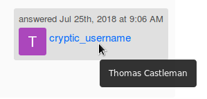

# StabOverflow
Online Q&A community for the St. Anne's-Belfield CS Department.

**Created by [Thomas Castleman](https://github.com/thomascastleman) and [Johnny Lindbergh](https://github.com/johnnylindbergh).**


## Introduction

Stab Overflow is a [Stack Exchange](https://stackexchange.com/)-like question-and-answer forum built specifically for the St. Anne's-Belfield CS Department, designed to promote positive inquiry and the exchange of ideas.

It allows students to direct questions towards a community of peers and faculty, all the while growing as a cumulative resource for future CS students.

While Stab Overflow was designed with computer science in mind, it has potential to be forked for use in other fields.

## Features

The current functionality of StabOverflow includes:
- [markdown editors](https://code.google.com/archive/p/pagedown/wikis/PageDown.wiki) for questions and answers (clean formatting, [syntax highlighting](https://github.com/google/code-prettify) with code)
- classification of questions based on adminstrator-determined categories
- an upvoting system to move the best answers to the top
- user profiles
- a fully-featured search engine with options to narrow results based on category, user, and number of answers
- user search tools
- authentication system to limit certain functionality to students only

## Authentication

Our authentication system uses [OAuth 2.0](https://oauth.net/2/) with Google (through [passport](https://www.npmjs.com/package/passport)) to securely verify the identity of users without requiring them to keep track of another password.

After authenticating, new users' emails are checked to confirm that they are of the `stab.org` or `students.stab.org` domain, and are entered into the system if so.

Only users who hold accounts in the system may participate in the posting of questions, answers, and comments. However, unauthenticated users are still able to view site content and make use of the search features.

## Identity Integrity

While users are allowed certain degrees of freedom in customizing their display name and optionally writing a profile description, their full name according to Google is kept on record and available, in most cases, by simply hovering over their display name. Their email is also available to administrators.



This immutable link is designed to prevent the potential troubles of anonymity as well as identity theft.

## Administrator Tools

Special administrator accounts have access to a host of features unavailable to regular users, including:
- manually adding new user accounts
- granting administrator privileges
- revoking administrator privileges
- creating, archiving, and deleting question categories
- deleting questions, answers, comments

Using these tools, administrators are able to manage and monitor the site even as time progresses and the curriculum and faculty change.


## Installation

Project dependencies can be installed by running `npm install` in the repository directory. 

Before `server.js` can be run, we must configure the database. To do this, log in to MySQL and run the command
 ```sql
SOURCE create_db.sql;
 ```
 This will configure the database. You will also need to set up a file named `credentials.js` which must take the following form:
 ```javascript
module.exports = {
	// Google OAuth2 credentials 
	GOOGLE_CLIENT_ID: '<YOUR GOOGLE CLIENT ID HERE>',
	GOOGLE_CLIENT_SECRET: '<YOUR GOOGLE CLIENT SECRET HERE>',

	// session encryption secret
	SESSION_SECRET: '<YOUR SESSION SECRET HERE>',

	// MySQL credentials
	MySQL_username: '<YOUR MYSQL USERNAME HERE>',
	MySQL_password: '<YOUR MYSQL PASSWORD HERE>',

	// localhost for testing purposes
	domain: 'http://localhost:8080'
}
 ```
 This will allow the system to access the Google API as well as execute database queries.
 
 Now, you may run `server.js` to start the system using the command
 ```
 node server.js
 ```
 The console should display something similar to 
 ```
 StabOverflow server listening on port 8080
 ```
